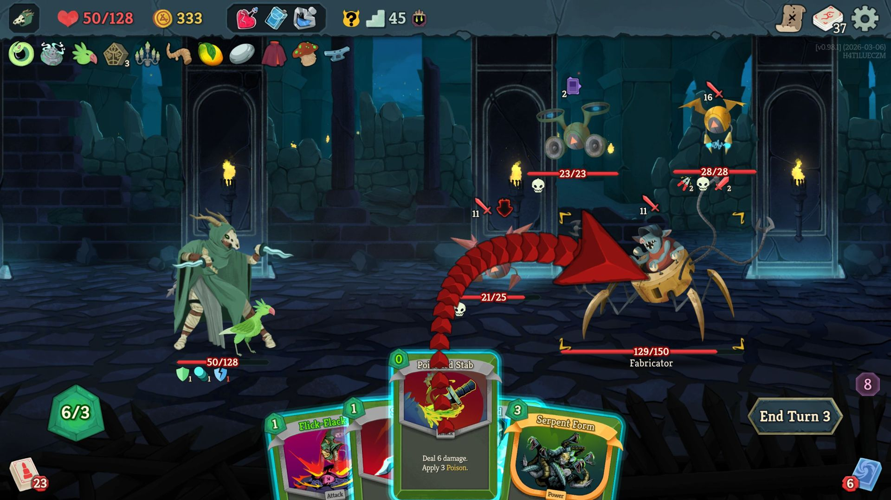
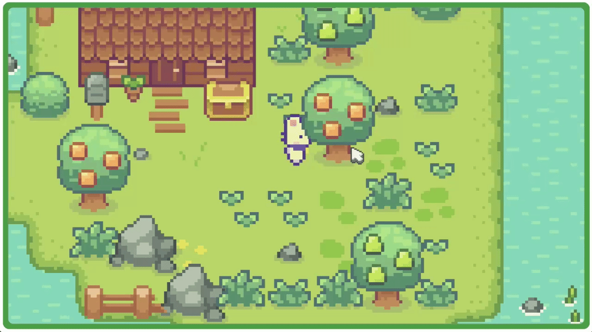

# **Catharsis**

## _Game Design Document_

##### **Copyright notice / author information / boring legal stuff nobody likes**

This videogames has been developed thoughout the February-June 2026 semester (April 6th, 2026 - ____) for the subject TC2005B: Software Construction and Decision Making (Group 501) for the Tecnológico de Monterrey in Campus Santa Fe

*Supervisors:* 
- Gilberto Echeverría Furió 
- Esteban Castillo Juarez
- José Ángel Martínez Navarro

*Development team:*

- Paulina Cortez Balvanera | A01782041
- María Espínola Forcén | A01787172
- Ilan Hanenberg Wasserman | A01787440

##
## _Index_

---

1. [Index](#index)
2. [Game Design](#game-design)
    1. [Summary](#summary)
    2. [Gameplay](#gameplay)
    3. [Mindset](#mindset)
3. [Technical](#technical)
    1. [Screens](#screens)
    2. [Controls](#controls)
    3. [Mechanics](#mechanics)
4. [Level Design](#level-design)
    1. [Themes](#themes)
        1. Ambience
        2. Objects
            1. Ambient
            2. Interactive
        3. Challenges
    2. [Game Flow](#game-flow)
5. [Development](#development)
    1. [Abstract Classes](#abstract-classes--components)
    2. [Derived Classes](#derived-classes--component-compositions)
6. [Graphics](#graphics)
    1. [Style Attributes](#style-attributes)
    2. [Graphics Needed](#graphics-needed)
7. [Sounds/Music](#soundsmusic)
    1. [Style Attributes](#style-attributes-1)
    2. [Sounds Needed](#sounds-needed)
    3. [Music Needed](#music-needed)
8. [Schedule](#schedule)

## _Game Design_

---

### **Summary**
*Catharsis* is a rougelite videogame in 2D where you take the role of a little cat that comes to a new village and discovers his neighbours are behaving quite strange, just to learn that at night they are turning into mosnters. He slowly discovers some new cards across the town that will help him protect himself and his new home. 
You will randomly explore the different houses of your neighbours, use your cards to save them and protect yourself, and find what is happening around the village.

Every time you get to heal your neighbours you will obtain experience points that will help us keep developing the story and obtain better cards that will increase your abilities to fight, defend, heal and control your neighbours. Giving the monster random abilities every night that forces you to think about how to defend yourself without harming them. Learning more about what is the secret behind the way of how your neighbours are behaving.

### **Gameplay**
**Description and context**

*Catharsis* is a story that will follow you; a little black cat that moves to a new village "Finetown" - in search for a new home, at first glance, the town will appear warm and welcoming since it is a colorful village with peaceful routines. In there he meets his new neighbours, who seem to not behave so fine - they rarely go out and do not seem to talk a lot, as the night falls, the cat will begin to notice many unsettling changes: the villagers seem to behave erratically, eventually transforming into strange and hostile creatures.

The game starts by showing your new house in your new neighbourhood - inside the house we can see a small letter that explains the rules of your new home:
1. Feel free to explore your surroundings, the nature is full of fruits and surprises.
2. Please return home before nightfall. Nights can be unpredictable
3. Be nice to everyone! A small act of kindness may be remembered longer than you think!
4. If you notice unusual behaviour, do not panic. It will return to normal in the morning
5. If you hear something calling your name in the night... ignore it!
6. Do not enter locked houses, some doors are closed for a reason.

*We hope you enjoy your stay, you'll get used to it!*

After reading the letter, you go outside where you meet the villagers who live next to your house; **Rotoplas**, a small purple rabbit with dark circles around her eyes and seems afraid of everything and **Little Jimmy**, a fluffy dog who always wear a night gown and a sleeping hat, he is always tired yet he never opens his eyes. They also seem to mention another one of your neighbours; Billy-Bob yet you are never able to see him. As a protagonist, the user must explore the village by entering their different houses. The rougelite elements depend a lot on how the procedurally change the layout and the powers of each creature every time. Allowing the player to keep learning fragments of the story, hidden secrets and discover the different cards. 

**Objective**

The final goal will be to cure the different neighbours that live across your home through a card-based combat interaction system, where the user is capable of collecting different cards that obtain different capacities like attacking, healing, defending and controlling your enemies, yet unlike usual combat systems - the user should not search to eliminate the neighbours but instead to protect or 'purify' them, allowing them to return to their normal state without harm and trying to learn more about the weird curse that seems to posess the village.

**Important elements**

For the Rougelite mechanics, it has been cosndiered the need for replayability for the multiple runs. Throughout the gameplay, the player will engage in the exploration of the village - in there the layout of the houses, the encounters and rewards will change every night. This random system will be reinforced through a card-based system that will be described below, where the player will gradually build their set up and how they choose between the options to fight and defend - trying to force the user to think strategiacally to achieve a win. Adding the fact that the game will depend on a progression system that will depend on healing the neighbours in order to keep obtaining experience points to unlock cards, abilities and upgrades for the next turn. In case we are presented with a failure during the night, it will be presented as a dream and will force the user to restart the current run - preserving the long-time progress yet allowing to try the again and grow and experiment with different cards. At the same time, considering that the randomized enemy behaviour wil be changed every night, and will force the player to adapt to grow. The unpredicatbility will help the storyline to progress and create a balance between abilities.

This game is built arround a dynamic card based combat system with four card categories that are attack,, defense, crowd control and healing. Every card consumes energy that regenerates each turn preventing spam and forcing players to think carefully about every move. Cards are discovered through exploration across a randomized map that ensures no runs are the same. Winning an encounter rewards the player with cards and duplicates can be fused together to level up their stats.

Death means that the player go down to just 3 random cards pushing them to explore aggressively and rebild from scratch. Each run ends with a boss encounter that puts every skill and card the player has gathered to the ultimate test. 

**References and Inspirations**

*Catharsis* has been developed with inspiration form multiple titles from different genres. As a team, it has been decided that the concept od the mechanics and rougelite structure is influenced by games like *Slay the Spire (2019)*, who is the image for card combat systems and its way to be replayable thoughout the gaming rounds.

*Slay the Spire(2019) - Similarities for card concept*

For the general concept, it has been taken a contrasting approach; it mixes both a cute and dark tone - for the same reason we decided to take inspiration from games that mix the concept of disturbing and emotional themes and subtle visual horror and cute and cozy games that depend more on social interactions.

*Cult of the Lamb (2022)* and *Omori (2020)* were the main inspirations for the emotional yet dark storytelling that the game will be based on, since they are games that seem unsettling either from start of slowly fading from a safe environment to a more horrifying one. 

*Omori (2020) - Similarities for themes and visual tone*

Lastly, it was mentioned that there is also some inspiration from more soft and cozier games; the main inspirations being *Animal Crossing (2001)*, *Stardew Valley (2016)* and *Sprout Valley (2023)*. Games that are known for their peaceful gameplay and daily routines, and their need for social interactions. At the same time, the main visual inspirations come from here - considering their cozy and warm atmosphere that makes you feel safe, contrasting to the dark themes that come later on the game.

*Sprout Valley (2023) - Similarities between visual and color palettes*

### **Mindset**

*Catharsis* is designed to provoke a constant feeling of empathy. The player should never feel fully powerful, instead they should feel like they have just enough tools to make a difference. The whole game is an allegory to the concept that being kind and having hope will bring you good things back.

By day the village feels calm and safe, encouraging curiosity and the need for exploration. By night the tone shifts into something tense and uncertain - activating the sense of alert and need to be careful with your surroundings. The player knows the monsters in front of them are their neighbours; actual living creatures, which makes every decision feel heavy. You're not here to destroy, you're here to protect.The goal is to make the player feel nervous but hopeful always one bad hand away from failure, but always believing they can pull it off.

## _Technical_

---

### **Screens**

1. Title Screen
    1. Options
2. Level Select
3. Game
    1. Inventory
    2. Assessment / Next Level
4. End Credits

_(example)_

### **Controls**

How will the player interact with the game? Will they be able to choose the controls? What kind of in-game events are they going to be able to trigger, and how? (e.g. pressing buttons, opening doors, etc.)

### **Mechanics**

Are there any interesting mechanics? If so, how are you going to accomplish them? Physics, algorithms, etc.

## _Level Design_

---

_(Note : These sections can safely be skipped if they&#39;re not relevant, or you&#39;d rather go about it another way. For most games, at least one of them should be useful. But I&#39;ll understand if you don&#39;t want to use them. It&#39;ll only hurt my feelings a little bit.)_

### **Themes**

1. Forest
    1. Mood
        1. Dark, calm, foreboding
    2. Objects
        1. _Ambient_
            1. Fireflies
            2. Beams of moonlight
            3. Tall grass
        2. _Interactive_
            1. Wolves
            2. Goblins
            3. Rocks
2. Castle
    1. Mood
        1. Dangerous, tense, active
    2. Objects
        1. _Ambient_
            1. Rodents
            2. Torches
            3. Suits of armor
        2. _Interactive_
            1. Guards
            2. Giant rats
            3. Chests

_(example)_

### **Game Flow**

1. Player starts in forest
2. Pond to the left, must move right
3. To the right is a hill, player jumps to traverse it (&quot;jump&quot; taught)
4. Player encounters castle - door&#39;s shut and locked
5. There&#39;s a window within jump height, and a rock on the ground
6. Player picks up rock and throws at glass (&quot;throw&quot; taught)
7. … etc.

_(example)_

## _Development_

---

### **Abstract Classes / Components**

1. BasePhysics
    1. BasePlayer
    2. BaseEnemy
    3. BaseObject
2. BaseObstacle
3. BaseInteractable

_(example)_

### **Derived Classes / Component Compositions**

1. BasePlayer
    1. PlayerMain
    2. PlayerUnlockable
2. BaseEnemy
    1. EnemyWolf
    2. EnemyGoblin
    3. EnemyGuard (may drop key)
    4. EnemyGiantRat
    5. EnemyPrisoner
3. BaseObject
    1. ObjectRock (pick-up-able, throwable)
    2. ObjectChest (pick-up-able, throwable, spits gold coins with key)
    3. ObjectGoldCoin (cha-ching!)
    4. ObjectKey (pick-up-able, throwable)
4. BaseObstacle
    1. ObstacleWindow (destroyed with rock)
    2. ObstacleWall
    3. ObstacleGate (watches to see if certain buttons are pressed)
5. BaseInteractable
    1. InteractableButton

_(example)_

## _Graphics_

---

### **Style Attributes**

What kinds of colors will you be using? Do you have a limited palette to work with? A post-processed HSV map/image? Consistency is key for immersion.

What kind of graphic style are you going for? Cartoony? Pixel-y? Cute? How, specifically? Solid, thick outlines with flat hues? Non-black outlines with limited tints/shades? Emphasize smooth curvatures over sharp angles? Describe a set of general rules depicting your style here.

Well-designed feedback, both good (e.g. leveling up) and bad (e.g. being hit), are great for teaching the player how to play through trial and error, instead of scripting a lengthy tutorial. What kind of visual feedback are you going to use to let the player know they&#39;re interacting with something? That they \*can\* interact with something?

### **Graphics Needed**

1. Characters
    1. Human-like
        1. Goblin (idle, walking, throwing)
        2. Guard (idle, walking, stabbing)
        3. Prisoner (walking, running)
    2. Other
        1. Wolf (idle, walking, running)
        2. Giant Rat (idle, scurrying)
2. Blocks
    1. Dirt
    2. Dirt/Grass
    3. Stone Block
    4. Stone Bricks
    5. Tiled Floor
    6. Weathered Stone Block
    7. Weathered Stone Bricks
3. Ambient
    1. Tall Grass
    2. Rodent (idle, scurrying)
    3. Torch
    4. Armored Suit
    5. Chains (matching Weathered Stone Bricks)
    6. Blood stains (matching Weathered Stone Bricks)
4. Other
    1. Chest
    2. Door (matching Stone Bricks)
    3. Gate
    4. Button (matching Weathered Stone Bricks)

_(example)_

## _Sounds/Music_

---

### **Style Attributes**

Again, consistency is key. Define that consistency here. What kind of instruments do you want to use in your music? Any particular tempo, key? Influences, genre? Mood?

Stylistically, what kind of sound effects are you looking for? Do you want to exaggerate actions with lengthy, cartoony sounds (e.g. mario&#39;s jump), or use just enough to let the player know something happened (e.g. mega man&#39;s landing)? Going for realism? You can use the music style as a bit of a reference too.

 Remember, auditory feedback should stand out from the music and other sound effects so the player hears it well. Volume, panning, and frequency/pitch are all important aspects to consider in both music _and_ sounds - so plan accordingly!

### **Sounds Needed**

1. Effects
    1. Soft Footsteps (dirt floor)
    2. Sharper Footsteps (stone floor)
    3. Soft Landing (low vertical velocity)
    4. Hard Landing (high vertical velocity)
    5. Glass Breaking
    6. Chest Opening
    7. Door Opening
2. Feedback
    1. Relieved &quot;Ahhhh!&quot; (health)
    2. Shocked &quot;Ooomph!&quot; (attacked)
    3. Happy chime (extra life)
    4. Sad chime (died)

_(example)_

### **Music Needed**

1. Slow-paced, nerve-racking &quot;forest&quot; track
2. Exciting &quot;castle&quot; track
3. Creepy, slow &quot;dungeon&quot; track
4. Happy ending credits track
5. Rick Astley&#39;s hit #1 single &quot;Never Gonna Give You Up&quot;

_(example)_

## _Schedule_

---

_(define the main activities and the expected dates when they should be finished. This is only a reference, and can change as the project is developed)_

1. develop base classes
    1. base entity
        1. base player
        2. base enemy
        3. base block
  2. base app state
        1. game world
        2. menu world
2. develop player and basic block classes
    1. physics / collisions
3. find some smooth controls/physics
4. develop other derived classes
    1. blocks
        1. moving
        2. falling
        3. breaking
        4. cloud
    2. enemies
        1. soldier
        2. rat
        3. etc.
5. design levels
    1. introduce motion/jumping
    2. introduce throwing
    3. mind the pacing, let the player play between lessons
6. design sounds
7. design music

_(example)_
