# **Catharsis**

## _Game Design Document_

##### **Copyright notice / author information / boring legal stuff nobody likes**

This videogames has been developed thoughout the February-June 2026 semester (April 6th, 2026 - ____) for the subject TC2005B: Software Construction and Decision Making (Group 501) for the Tecnológico de Monterrey in Campus Santa Fe

*Supervisors:* 
- Gilberto Echeverría Furió 
- Esteban Castillo Juarez
- José Ángel Martínez Navarro

*Development team: Supernova*

- Paulina Cortez Balvanera | A01782041
- María Espínola Forcén | A01787172
- Ilan Hanenberg Wasserman | A01787440

##
## _Index_

---

1. [Index](#index)
2. [Game Design](#game-design)
    1. [Summary](#summary)
    2. [Gameplay](#gameplay)
    3. [Mindset](#mindset)
3. [Technical](#technical)
    1. [Screens](#screens)
    2. [Controls](#controls)
    3. [Mechanics](#mechanics)
4. [Level Design](#level-design)
    1. [Themes](#themes)
        1. Ambience
        2. Objects
            1. Ambient
            2. Interactive
        3. Challenges
    2. [Game Flow](#game-flow)
5. [Development](#development)
    1. [Abstract Classes](#abstract-classes--components)
    2. [Derived Classes](#derived-classes--component-compositions)
6. [Graphics](#graphics)
    1. [Style Attributes](#style-attributes)
    2. [Graphics Needed](#graphics-needed)
7. [Sounds/Music](#soundsmusic)
    1. [Style Attributes](#style-attributes-1)
    2. [Sounds Needed](#sounds-needed)
    3. [Music Needed](#music-needed)
8. [Schedule](#schedule)

## _Game Design_

---

### **Summary**
*Catharsis* is a rougelite videogame presented in top-down perspective in 2D with a pixely artstyle, where you take the role of a little cat that comes to a new village and discovers his neighbours are behaving quite strange, just to learn that at night they are turning into monsters. He slowly discovers some new cards across the town that will help him protect himself and his new home. 
You will randomly explore the different houses of your neighbours, use your cards to save them and protect yourself, and find what is happening around the village.

Every time you get to heal your neighbours you will obtain experience points that will help us keep developing the story and obtain better cards that will increase your abilities to fight, defend, heal and control your neighbours. Giving the monster random abilities every night that forces you to think about how to defend yourself without harming them. Learning more about what is the secret behind the way of how your neighbours are behaving.

### **Gameplay**
**Description and context**

*Catharsis* is a story that will follow you; a little black cat that moves to a new village "Finetown" - in search for a new home, at first glance, the town will appear warm and welcoming since it is a colorful village with peaceful routines. In there he meets his new neighbours, who seem to not behave so fine - they rarely go out and do not seem to talk a lot, as the night falls, the cat will begin to notice many unsettling changes: the villagers seem to behave erratically, eventually transforming into strange and hostile creatures.

The game starts by showing your new house in your new neighbourhood - inside the house we can see a small letter that explains the rules of your new home:
1. Feel free to explore your surroundings, the nature is full of fruits and surprises.
2. Please return home before nightfall. Nights can be unpredictable
3. Be nice to everyone! A small act of kindness may be remembered longer than you think!
4. If you notice unusual behaviour, do not panic. It will return to normal in the morning
5. If you hear something calling your name in the night... ignore it!
6. Do not enter locked houses, some doors are closed for a reason.

*We hope you enjoy your stay, you'll get used to it!*

The letter will also include the basic instructions about how to develop themselves in the game in terms of both tasks and movement *(check in control section)*. 
 
After reading the letter, you go outside where you meet a villager who live next to your house; **Little Jimmy**, a fluffy dog who always wear a night gown and a sleeping hat, he is always tired yet he never opens his eyes. As a protagonist, the user must explore the village by entering their different houses. The rougelite elements depend a lot on how the procedurally change the layout and the powers of each creature every time. Allowing the player to keep learning fragments of the story, hidden secrets and discover the different cards. 

**Objective**

The final goal will be to cure the different neighbours that live across your home through a card-based combat interaction system, where the user is capable of collecting different cards that obtain different capacities like attacking, healing, defending and controlling your enemies, yet unlike usual combat systems - the user should not search to eliminate the neighbours but instead to protect or 'purify' them, allowing them to return to their normal state without harm and trying to learn more about the weird curse that seems to posess the village.

**Important elements**

For the Rougelite mechanics, it has been cosndiered the need for replayability for the multiple runs. Throughout the gameplay, the player will engage in the exploration of the village - in there the layout of the houses, the encounters and rewards will change every night. This random system will be reinforced through a card-based system that will be described below, where the player will gradually build their set up and how they choose between the options to fight and defend - trying to force the user to think strategiacally to achieve a win. Adding the fact that the game will depend on a progression system that will depend on healing the neighbours in order to keep obtaining experience points to unlock cards, abilities and upgrades for the next turn. In case we are presented with a failure during the night, it will be presented as a dream and will force the user to restart the current run - preserving the long-time progress yet allowing to try the again and grow and experiment with different cards. At the same time, considering that the randomized enemy behaviour wil be changed every night, and will force the player to adapt to grow. The unpredicatbility will help the storyline to progress and create a balance between abilities.

This game is built arround a dynamic card based combat system with four card categories that are attack,, defense, crowd control and healing. Every card consumes energy that regenerates each turn preventing spam and forcing players to think carefully about every move. Cards are discovered through exploration across a randomized map that ensures no runs are the same. Winning an encounter rewards the player with cards and duplicates can be fused together to level up their stats.

Death means that the player go down to just 3 random cards pushing them to explore aggressively and rebild from scratch. Each run ends with a boss encounter that puts every skill and card the player has gathered to the ultimate test. 

**References and Inspirations**

*Catharsis* has been developed with inspiration form multiple titles from different genres. As a team, it has been decided that the concept of the mechanics and rougelite structure is influenced by games like *Slay the Spire (2019)*, who is the image for card combat systems and its way to be replayable thoughout the gaming rounds.

*Slay the Spire(2019) - Similarities for card concept*

For the general concept, it has been taken a contrasting approach; it mixes both a cute and dark tone - for the same reason we decided to take inspiration from games that mix the concept of disturbing and emotional themes and subtle visual horror and cute and cozy games that depend more on social interactions.

*Cult of the Lamb (2022)* and *Omori (2020)* were the main inspirations for the emotional yet dark storytelling that the game will be based on, since they are games that seem unsettling either from start of slowly fading from a safe environment to a more horrifying one. 

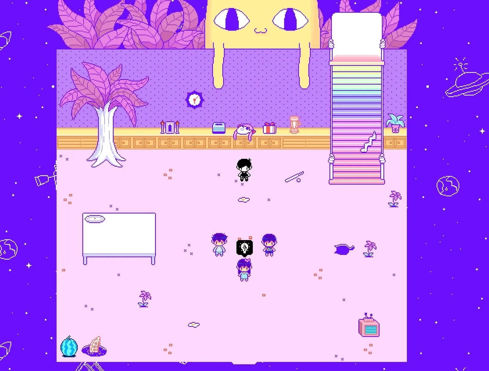
*Omori (2020) - Similarities for themes and visual tone*

Lastly, it was mentioned that there is also some inspiration from more soft and cozier games; the main inspirations being *Animal Crossing (2001)*, *Stardew Valley (2016)* and *Sprout Valley (2023)*. Games that are known for their peaceful gameplay and daily routines, and their need for social interactions. At the same time, the main visual inspirations come from here - considering their cozy and warm atmosphere that makes you feel safe, contrasting to the dark themes that come later on the game.

*Sprout Valley (2023) - Similarities between visual and color palettes*

**Starting Sketches**

Initial concepts for the game:
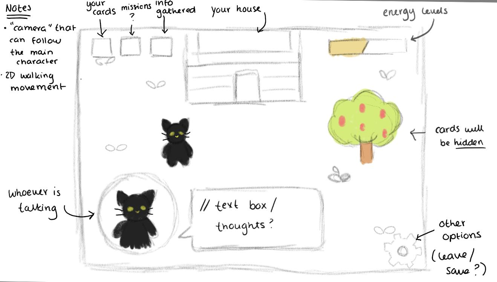
*UI idea and possible placement for elements*

Initial logo concept: 
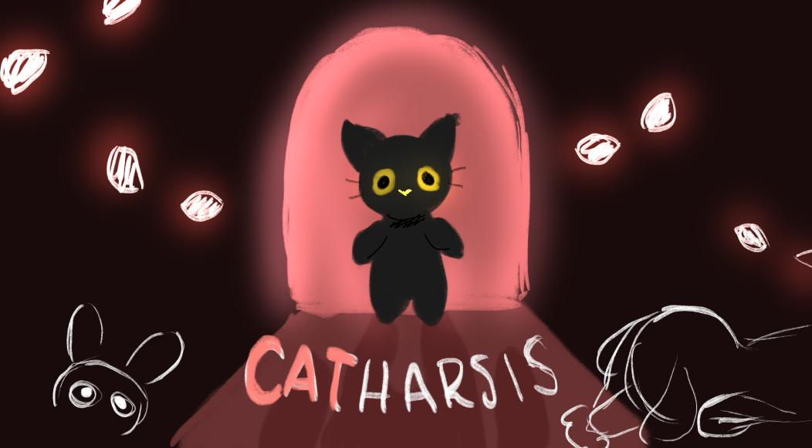
*Logo idea without pixel art*

### **Mindset**

*Catharsis* is designed to provoke a constant feeling of empathy. The player should never feel fully powerful, instead they should feel like they have just enough tools to make a difference. The whole game is an allegory to the concept that being kind and having hope will bring you good things back.

By day the village feels calm and safe, encouraging curiosity and the need for exploration. By night the tone shifts into something tense and uncertain - activating the sense of alert and need to be careful with your surroundings. The player knows the monsters in front of them are their neighbours; actual living creatures, which makes every decision feel heavy. You're not here to destroy, you're here to protect.The goal is to make the player feel nervous but hopeful always one bad hand away from failure, but always believing they can pull it off.

## _Technical_

---

### **Screens**

1. **Title Screen**

Purpose: It is the first impression that the player gets of our game, it gives the player access to the main options.
- Game logo and title: Positioned in the upwards central part of the screen, to establish the game’s identity.
- Start Button: A flashy button with the word “START” to draw the player to start the game’s experience.
- Options Menu Button: A button to allow the player to configure some aspects of the game.
- Credits Button: A section to recognize the game collaborators and developers.
- Background Music: An attractive and thematic track that sets the tone for the adventure.  
- Studio’s Name and Year: Supernova @2026. 

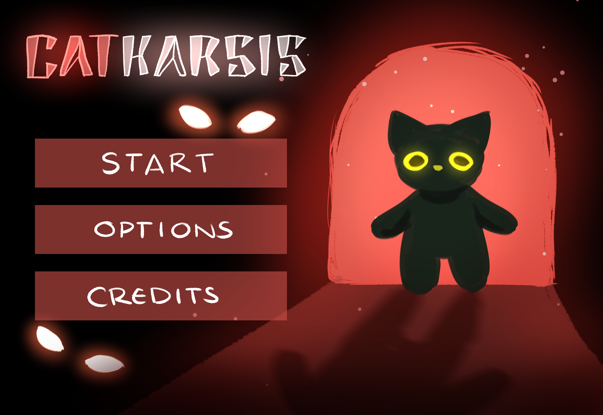
*(Title screen initial concept)*

2. Game/Map

Purpose: The main screen where the player navigates and interacts with the map.
- Inventory/Card Collection: A button that allows the player to see the cards they have acquired.
- Pause Button: Allows the player to stop for a moment the game and shows the Options Menu screen.
- Background Music: A track that sets the motion of the game.

 *(Game screen initial concept)* 

3. Inventory (Card Collection)
Purpose: Shows the player the cards they have acquired, it includes:

- Cards: Shows all the cards the player currently has and allows to show the player the information of each card.
- Back Button: Allows the player to return to the game screen.

*(Inventory screen initial concept)*

4. Statistics Menu

Purpose: It allows the player to show their progress and interact with some aspects of the game, it includes:
- Statistics: Allows the player to see the current stats of the game’s round.
- Back: During a round it allows the player to return to the game’s screen.

*(Statistics screen initial concept)*

5. Combat Screen

Purpose: It provides a visual stage for the battle between the player and the opponent/enemy, includes: 
- Battlefield: The area where the combat takes place and the cards are played.
- Hand Overlay: Positioned at the bottom part showing the player’s current playable cards.
- Music: The track that sets the tone of the combat.
- Health (life) Bar: Indicates the amount of health that the player and the enemy currently have.
- Energy Bar: Shows the player the amount of available energy to play cards.

*(Combat screen initial concept)*

6. Saving Menu:

Purpose: Screen that will allow the system to save the game and statistics of the progress and stop the game.
- Save **and** exit button: Button that allows to save the progress of the game and saves the current development of the player
- Exit button: Button to leave the game without updating the statistics about the player's progress.

*(Saving menu screen initial concept)*

7. Ending Credits: 

Purpose: Show the developers and collaborators of the game, includes:
- Names: The team’s members' names. 
- References: Giving credit to aspects used in the game from other sources.
- Back: Allows the player to return to the Title Screen. 
- Background Music: Same as the Title Screen.

*(Ending credits screen initial concept)*

### **Controls**

1. Moving: The controls will require the usage of the W, A, S, and D for determining the movement.
    - W: up
    - A: left
    - S: down
    - D: right 

2. Combat: 
- Selection: Hover the mouse to select a card and see the description, effects and cost of each card.
- Execution: Click to play the selected card during a combat (each card type has its own visual and sound effect).

3. Navigate:
- You can navigate around the screens by using the mouse.
- Click on the button that you want to interact with.  

### **Mechanics**

Our game introduces multiple mechanics that allow the game to feel unique, strategic and interactive.

**1. Random Generation:** 
- Map Generation: Every time the player starts a new run the map inside the house will generate randomly from 2 map designs.
- Enemy’s stats and gameplay: Every run and combat encounter, the enemy health will change depending on the level or difficulty. The heath is generated from a predefined numerical range. Additionally, the enemy may have slight variations in behavior, making each encounter less predictable.
- Card Placement: The location of cards that are hidden around the map is different every level and run, encouraging exploration.
- Hand Overplay or Deck System: In every combat encounter, the cards available in the player’s hand are randomly drawn from the deck of cards the player has acquired up to that point. Cards can appear multiple times in the deck. This introduces variability in each turn and forces the player’s strategy to adapt based on the current hand.

**2. Energy:**
- Cards Energy Cost: Each card requires a certain amount of energy to be played. The player has a fixed amount of energy available in every combat encounter, meaning the available energy doesn’t change between combats. This forces a strategic decision making, as the player must carefully choose how to spend their energy each turn. More powerful cards consume more energy, while simpler cards require less. 
- Wildcard Card (Energy Trade-Off): The game includes a special card aside from the hand overplay. The wildcard is a special card that allows the player to regenerate energy at the cost of losing health.
- Energy Bar: The player has a fixed amount of energy every combat, the maximum amount of energy that the player can have is 150 points. The bar regenerates 100 points at the start of each combat encounter.  

**3. Cards:**

The cards are the main element of the game. These are the primary way the player interacts with the enemy and progresses through each run and level.
- Card Types: Cards are divided into four types:
    - *Attack*: Cards that deal damage to enemies, the damage of each card is based on predefined numerical range.
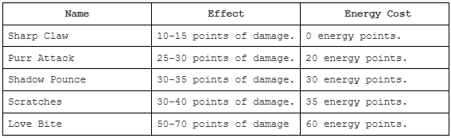

    - *Defense*: Cards that provide protection or restore health. 
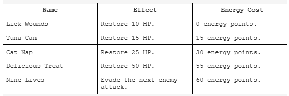

    - *Control*: Cards that affect the flow of the combat, such as limiting the enemy actions.
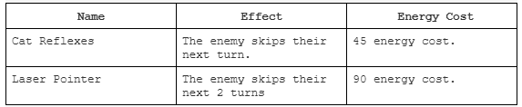

    - *Wildcard*: Special cards with the unique effect of trading health for energy, introducing high risk decisions.
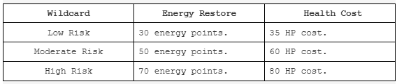

- Deck Building: As the player explores the map, they will find new cards that are added to their collection.
- Card Usage: During combat, the players use cards from their hand by spending energy. The hand is randomly generated each encounter, so players must adapt their strategy.

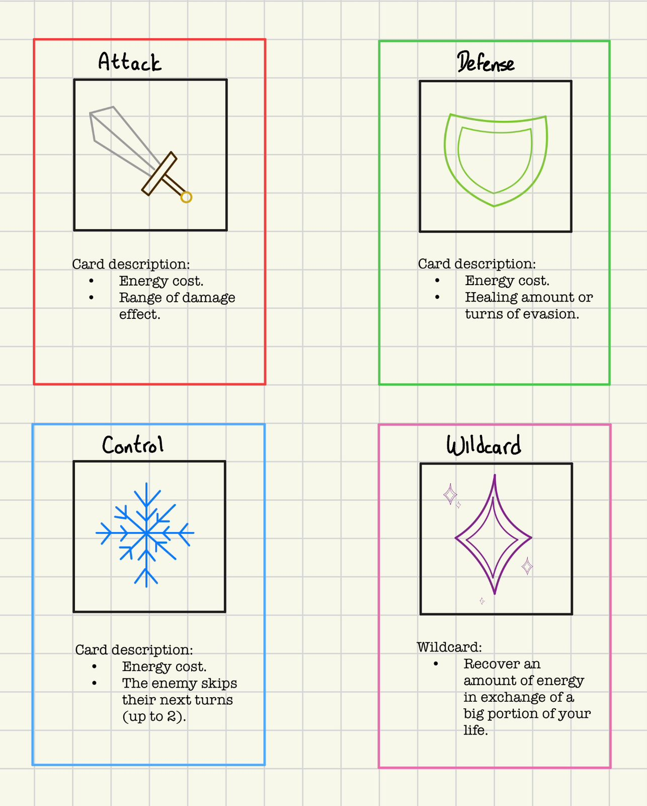

4. Scoring System: 

The objective of the scoring system is to encourage the player to continue playing in order to improve their performance and track their progress, while also showcasing their achievements. 
- Stats calculation: Throughout each run,the game tracks different metrics of performance. These stats may include:
    - Damage Taken
    - Damage Dealt
    - Cards Collected 
    - HP Recovered
    - Time
- End of Run Display: When the player dies or finishes the run, a summary screen is shown displaying the collected stats. This allows the player to see their performance and improvement areas in future runs. 

5. Map

The map represents the area (both interior of the house and exterior) where the player explores each run. Designed to encourage exploration and decision making.
- Exterior Area: This area remains the same in every run and it's not generated randomly. The player can explore this area to find and acquire cards for progression.
- Interior Area: This is in the interior of the house, each run generates a small set of rooms inside the house. In addition to the entrance there are 3-4 rooms randomly generated. The position and connection of these rooms changes every run.
- Enemy/Boss Room: One of the interior rooms contains the main enemy, its location is randomized every run. This is the key objective of the run, and the payer must face it to complete the level.
- Exploration: The remaining rooms of the house and the exterior can be both explored to find new cards, allowing the player to prepare and progress before facing the main enemy. 
- Player Interaction: The player can move around the exterior and interior areas of the map, upon entering a room the player can interact with it to find and collect cards. The player’s exploration is sequential, meaning the player chooses the order in which to visit the rooms. The hidden cards of each room cannot be collected more than once.
- Random Layout: The position of each interior room is randomized every run, encouraging exploration.

6. Enemy
- Enemy Stats: The enemy has a set amount of health that varies depending on the level. Its health is generated from a predefined numerical range.
- Behavior: The enemy may have slight variations in behavior, making each combat less predictable.
- Progression: To complete the game, the player must defeat the enemy 3 times in a single run. After each defeat the difficulty of the enemy increases progressively.
- Player Interaction: The player interacts with the enemy through the card system during each combat. By playing cards the player can deal damage, control or defeat the enemy. The player must adapt their strategy based on the enemy’s behavior. During its turn, the enemy can attack and deal damage to the player, reducing their HP.
- Defeat: If the player’s health reaches 0, the run ends and their performance and stats are recorded.
- Final Objective: The run is completed once the player defeats the enemy a third time.  

## _Level Design_

---

### **Themes**

1. Outside world: Surroundings around the neighbourhood.
    1. Mood
        1. Light, soft, and calm. 
    2. Objects
        1. _Ambient_
            1. Flowers
            2. Grass
        2. _Interactive_
            1. Bushes
            2. Trees
            3. Houses (Personal and Neighbour's)
2. Personal House
    1. Mood
        1. Cozy, warm and homelike
    2. Objects
        1. _Ambient_
            1. Furniture
        2. _Interactive_
            1. Letter
            2. Bed
            3. Door
3. Little Jimmy's House
    1. Mood
        1. Version I: Unsettling, weird, and not entirely safe - backroom similarities
        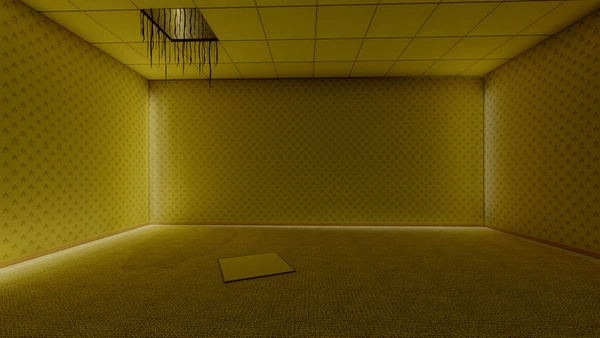

         *(Inspiration for the Version I room)*

        2. Version II: Dark, scary and mysterious - entirely dark room where barely anything sees the light
        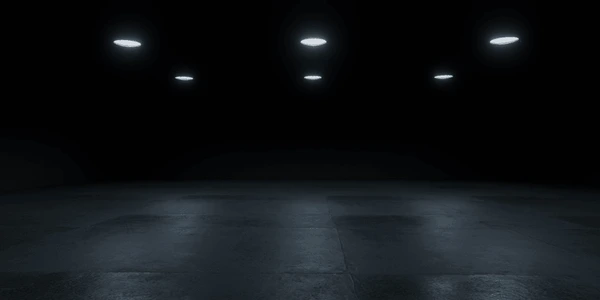
        
        *(Inspiration for the Version II room)*

        3. Version III: Muted, silent and very lonely - the area is fulfilled with plants yet there is no sign of life.
        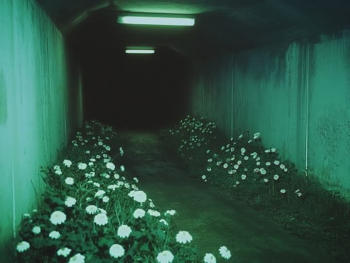

        *(Inspiration for the Version III room)*

    2. Objects
        1. _Interactive_
            1. Enemy
            2. Doors
            3. Cards

### **Game Flow**

**Game Starts**
1. A start menu appears displaying the game's title and a button to begin.
2. The player spawns in a flat village featuring bushes, trees, and two houses.
3. The HUD is displayed, including the player's health bar.

**Initial Exploration**
1. The player begins inside their own house, where a letter is found explaining the game's controls and the village's rules.
2. The player explores the village, discovering letters scattered near bushes, chairs, and trees.
3. The player notices that their neighbor is asleep outside their house.
4. The player observes that Little Jimmy's house is emanating loud and unusual noises.

**Night Exploration**

1. The player exits their house to find that Little Jimmy is still inside his home, which continues to produce loud noises.
2. The player enters the house to investigate and ensure everything is alright.
3. A combat encounter begins in an attempt to cure Little Jimmy.
4. If the player is defeated, the game resets and the player retains only 3 randomly selected cards from their deck.
5. If the player wins, Little Jimmy is partially cured.
6. The player returns home to rest.

**Second Day**
1. The player resumes their investigation of the village.
2. The player continues to discover new cards throughout the environment.

**Second Night**
1. The player returns to Little Jimmy's house.
2. A second combat encounter begins in another attempt to cure Little Jimmy.
3. If the player is defeated, the game resets and the player retains only 3 randomly selected cards from their deck.
4. If the player wins, Little Jimmy is further cured.
5. The player returns home to rest.

**Third Day**

1. The player resumes their investigation of the village.
2. The player continues to discover new cards throughout the environment.

**Third Night**

1. The player returns to Little Jimmy's house.
2. A third and final combat encounter begins in a last attempt to cure Little Jimmy.
3. If the player is defeated, the game resets and the player retains only 3 randomly selected cards from their deck.
4. If the player wins, Little Jimmy is fully cured and appears in his normal form.
5. The player saves the village and the game concludes.

## _Development_

---

### **Abstract Classes / Components**

For the creation of the game Catharsis, we need to consider the next classes and components that will be used for the game’s development.

1. BasePhysics: Game physics, collisions and movement. 
    - BasePlayer: Control of the player’s movement and progress.
2. BaseObstacle: Defines the elements that can collide or block the player, like trees, bushes, doors, walls, etc.
3. BaseEnemy: Controls the enemy actions.
4. BaseInteractive: Defines the elements that the player can interact with, like doors to open a room or places where a card is hidden. 
5. BaseSound: Controls the sound effects of the game.
6. BaseMusic: Controls the music tracks of the game.
7. BaseMap: Controls the random generation of the levels and map. 
8. BaseCard: Defines and controls the stats, effects and costs of the  cards. 
9. BaseUI: Controls the base interface of the player, energy bar, health bar, unlocked cards, etc.

### **Derived Classes / Component Compositions**

1. BasePlayer
- PlayerMain: Main character controlled by the player.
2. BaseObstacle
- ObstacleTree: Tree that blocks the movement of the player.
- ObstacleBox: Box that blocks the movement of the player.
- ObstacleBush: Bush that blocks the movement of the player.
3. BaseEnemy
- EnemyMain: Boss/Main Enemy controlled by the IA of the game.
4. BaseInteractive
- InteractiveTree: A tree that can be interacted by the player.
- InteractiveBox: A box that can be interacted by the player.
- InteractiveBush: A bush that can be interacted by the player.
5. BaseSound
- SoundHealing: A sound for when a healing card is used.
- SoundHit: A sound when an attack card is used.
- SoundShimmer: A sound when a card is found around the map.
6. BaseMusic:
- MusicMain: The track that will take place in must moments of the game except while in combat.
- MusicCombat: The track that will take place in the moments when there’s combat. 
7. BaseCard:
- CardAttack: Controls the attack cards.
- CardDefense: Controls the defensive cards.
- CardControl: Controls de control cards.
- CardWildcard: Controls the wildcards.

## _Graphics_

---

### **Style Attributes**

The game follows a concept where contrast is a very important factor. The pixel-artstyle will be consistent throughout the whole game, yet, day and night should depend on a high contrast between themes. Day time will consist of lighter colors, a softer color palette and the surroundings will be fulfilled with little trees and bushes with fruits.

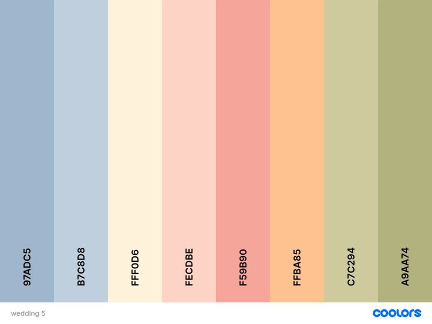

On the other side, we have a darker theme for the nights, consisting on a darker color palette and a more unsettling atmosphere. The pixel artstyle is still consistent but we depend on a much weird style where everything seems strange. The different rooms inside Little Jimmy's house have different color palettes yet all of them maintain the weird theme and minimalist areas. 

### **Graphics Needed**

1. Characters
    1. Protagonist (player)
        1. Black cat (idle, walking up/down/left/right)
    2. NPCs
        1. Little Jimmy - normal form (idle, sleeping)
        2. Little Jimmy - monster form (idle, attacking, defeated)
2. Tiles / Environment
    1. Exterior
        1. Grass
        2. Dirt path
        3. Flowers
        4. Bush (regular, interactive)
        5. Tree
        6. Fence
    2. Interior - Player's house
        1. Wooden floor
        2. Walls (cozy style)
        3. Furniture (bed, table, chair)
    3. Interior - Little Jimmy's house
        1. Dark floor
        2. Walls (unsettling style, Version I and II)
3. Interactable Objects
    1. Letter (on table)
    2. Door (house exterior)
    3. Discoverable cards 
    4. Fruit (on bushes and trees)
4. HUD / UI
    1. Health bar (player and enemy)
    2. Energy bar
    3. Card frame (per category: attack, defense, healing, crowd control)
    4. Card illustrations (one per card)
    5. Inventory screen background
    6. Statistics menu overlay
    7. Saving screen overlay
5. Screens
    1. Title screen background
    2. Game logo / wordmark
    3. Credits screen background
6. Effects
    1. Day/night lighting overlay
    2. Damage / heal visual feedback
    3. Victory effect (Little Jimmy cured)

## _Sounds & Music_

---

### **Style Attributes**

The music of Catharsis will consist of two different tracks that will be played depending on the state or scene of the game. The main track will be played in a loop for most of the instances of the game while the second track will be only played while in combat. Both will be played in a loop. 

This way we maintain a cohesive atmosphere while providing a dynamic shift in the energy according to what is happening in the game. 

### **Sounds Needed**

1. ***Effects***
- The sound effects (SFX) are designed to provide feedback to the auditory player, ensuring each interaction from the player feels responsive, intuitive and impactful. To maintain the aesthetic of the game, the sound effects design will be inspired by a retro bit style, matching the game’s pixel-art identity.
- **Movement**   
    - A walking/foot steps effect while the player is exploring and moving around the map.
- **Interactions**  
    - Finding a card, like a shimmer effect.
    - Opening a door, a wooden creak effect (when you enter the house of the enemy).
- **Cards/Combat**
    - Healing card effect.
    - Attack card effect. 
    - Control card effect (like a freezing effect).
    - Victory/defeating the enemy.

2. ***Feedback***
- Due to current development scope, the feedback from sound effects will be kept  direct and functional. Beyond basic interactions, the sound effects serve to communicate the player’s status and the weight of their choices, the combat feedback is prioritized through different sounds that signal the state of the battle and the actions that are taking place.

### **Music Needed**

The game will feature two tracks that define the gameplay state, designed to distinguish between peaceful exploration and active engagement for combat.

***Details:***
- **Atmospheric Exploration (Main Track):** 
    - Style: Ambient, melodic and immersive.
    - Function: This track plays during the Title Screen, World Map, Inventory and Credits. It’s meant to be non-intrusive, allowing the player to focus on the game while still being immersed in the atmosphere that it provides for the game.

- **Combat (Battle Track):**
    - Style: High tempo, percussive and driving.
    - Function: It will trigger immediately upon entering combat. The shift in rhythm creates a new atmosphere that generates a state of action for the player.

## _Schedule_

---

**1. Week 1 — Foundations** (May 5–11)
- Project Setup: Initial configuration of the game project within the engine.
- Base Classes: Development of the fundamental architectural components:
    - Base Entity: Core logic for game objects.
        - Base Player: Handles character-specific logic.
        - Base Enemy: Handles AI and adversary logic.
- Base App State: Management of different game phases:
    - Game World: Implementation of exterior maps and interior house layouts.
    - Menu World: Development of the title screen and navigation.
- Controls: Player movement using WASD and implementation of basic collision systems.

**2. Week 2 — Exploration and World** (May 12–18)
- Interactions: A robust system for object interaction, including:
    - Starting Letter: Serves as the controls tutorial for the player.
    - Doors: Mechanics for entering and exiting houses.
    - Hidden Cards: Discoverable elements scattered across the map.
- Environment: Day/night cycle with dynamic palette and lighting shifts.
- UI/HUD: Basic interface elements for tracking gameplay:
    - Health Bar: Visual representation of player vitality.
    - Energy Bar: Visual representation of resource levels.

**3. Week 3 — Combat System** (May 19–25)
- Mechanics: Core card system functionality:
    - Hand Overplay: Management of the player&apos;s active hand.
    - Energy Trade-Off: Consumption of energy per turn.
    - Interaction: Card execution triggered on click events.
- Classification: Implementation of card types:
    - Attack: Cards that deal damage.
    - Defense: Cards that provide protection.
    - Healing: Cards that restore health.
    - Control: Cards for crowd management.
- Encounter: Initial combat sequence against Little Jimmy.
- Logic: Defeat conditions and reset mechanics (return to 3 random cards).

**4. Week 4 — Progression and Content** (May 26 – June 1)
- Progression: Experience system and card unlocking mechanics.
- Upgrades: Fusion of duplicate cards to level up stats.
- Scaling: Three distinct combat encounters against Little Jimmy with escalating difficulty.
- Variability: Roguelite elements introduced via layout variations per night.

**5. Week 5 — Polish and Delivery** (Jun 2–8)
- Art Assets: Final sprites and illustrations, including:
    - Protagonist: Idle and movement animations.
    - Little Jimmy: Sprites for normal and monster forms.
    - Cards: Unique illustrations for each card category.
- Audio Design: Soundscape development:
    - Exploration Music: Looping ambient tracks.
    - Combat Music: Looping high-energy tracks.
    - Sound Effects: Specific audio cues for gameplay:
        - Environment: Player footsteps and door opening sounds.
        - Interactions: Shimmer sounds for card discovery.
        - Mechanics: Audio effects tailored to each card type.
- Interface: Creation of secondary game screens:
    - Collection: Inventory and card collection screens.
    - Credits: Ending sequence and contributor list.
- Quality Assurance: Final testing, bug remediation, and difficulty balancing.

