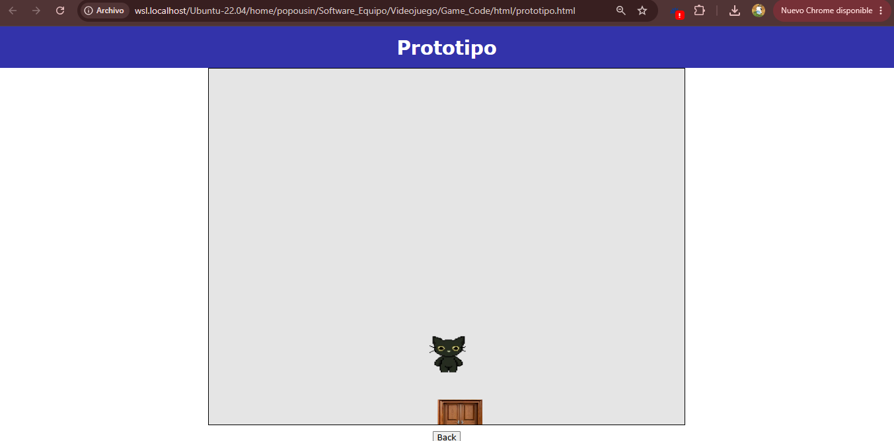
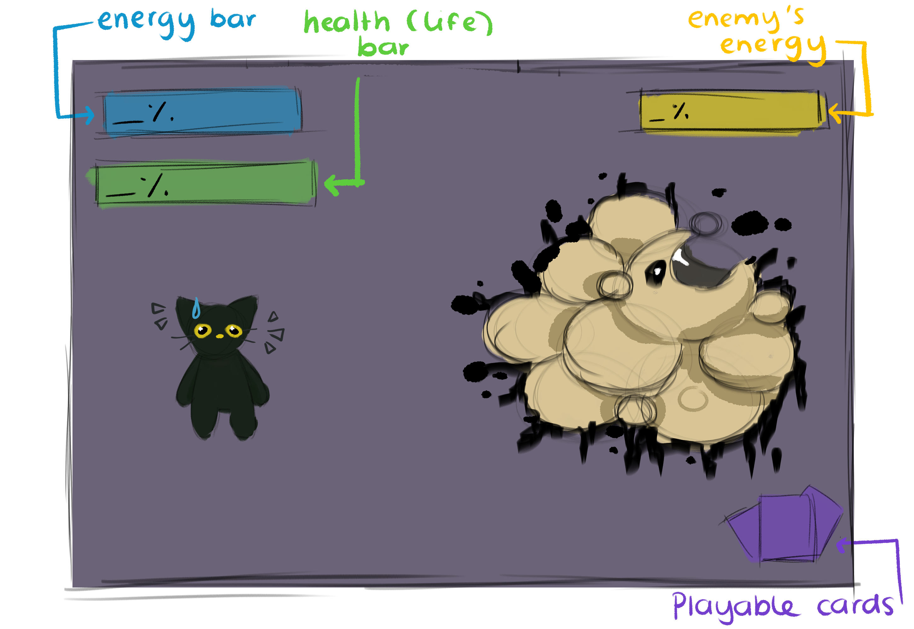

# Catharsis Instructions

***Prototype edition***

**How to download the game?**

First, download the folder **"Videojuego"** or clone this repository in order to gain access to the folder "Videojuego". When downloaded, we need to search for a folder called **Game_Code**, inside this folder there are four visible folders:
- assets/sprites
- css
- html
- js

The relevant folder we need to localize is **html**, inside this folder we have a file called *prototipo.html*, please select this file and open it through the browser of your choice. When done it should appear a screen similar to this one: 

Feel free to start exploring the prototype (check control instruction down below)

**Objective of the protype: What does this game include?:**

The current prototype was developed in order to contain the interior maps for both houses and the exterior map for the surroundings. This work also includes the basic mechanics of the cards and their function throughout the gameplay in terms of energy and health. And the collisions with different bushes to obtain new cards are also available.

**Prototype Explanation: What is the current progress**

The player starts in their own home, where the only current visible sprite is the door available that will help them leave their home. When collisioning with the door, the player will be on the outside map. 

On the outside map, there are three main sprites; the house of the character, the house of the neighbour and the different bushes. The player's house will only work for entering the house, then we have the bushes; these bushes contain cards hidden betwwen them - in the case of this prototype, we are only considering that the cards are currently hidden in established bushes, yet, the project as a whole will require to randomize which bushes will have cards or not. The last relevant sprite is your neighbour's house; this house is open for you as a player in order to continue the game. When touched, you get the interior map of your neighbour's house, in which there are three visible doors. It is supposed that randomly, two rooms will be selected two include cards in them and the other one that is left, will contain the enemy that the player needs to fight. Currently, the prototype is set to have the enemy's room established, but for the final version, the enemy's room will be either of the three rooms. In there the battle scene can be performed and played with cards.

**Game controls**

*Movement*
| Key | Action |
|---|---|
| W | Move Up |
| A | Move Left |
| S | Move Down |
| D | Move Right |

*Battle*

For the battle section, the user is not required to move but instead to use their cursor to select the respective card they want to use to develop throughout the battle. In case the player loses, the losing screen will appear and will ask for space in order to restart. If the player wins, the screen will restart at the player's house. 